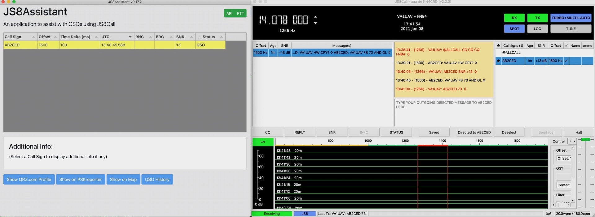
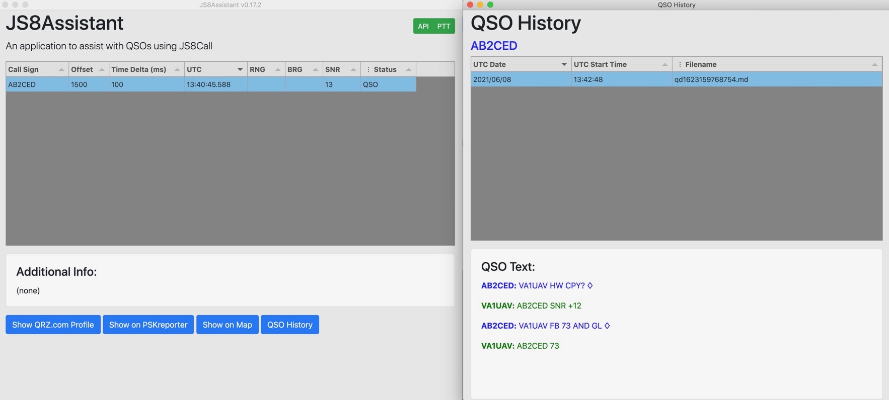

# JS8Assistant
A Node.js and Electron cross-platform application to assist with using JS8Call.

The primary purpose of this application is to provide information about the current
activity in JS8Call and in particular information about previous QSOs including the
text of the messages that were exchanged which is referred to as QSO History. 
It will also try to supply public information about call signs and allow lookups with your
default web browser on QRZ.com and PSKReporter. There is also the option to show the 
grid square on levinecentral.com.

# History
When I first started using JS8Call for QSOs I tried to keep good notes about the conversations 
but of course I got lazy after a while and wasn't very consistent about it. That meant that
I was always having to search my notes about a call sign to see if I there were any and if not
try to find info on the web, usually by using QRZ.com.

I had previously worked on a project to help with net control using the JS8Call API and decided to
try and build on what I had accomplished with that.

I have been using JS8Assistant for a number of months now and finally in June 2021 I found
the time and energy to clean it up enough to release it as open source. I hope it is
as helpful for others as it is for me!

# Installation
This is a Node.js application and uses the Electron framework. It uses web technologies and
is cross platform. It should run under MacOS, Windows 10 and at least Debian flavours of Linux 
(including the Raspberry Pi) without any changes.

### Binaries
The are binaries for Windows, Linux and MacOS for the latest release:

https://github.com/RocketManRC/JS8Assistant/releases/tag/v0.30.0

The Windows packages have been checked at virustotal.com but you probably want to check them again yourself.

### Source
Make sure you have a recent long term supported (LTS) version of NodeJS installed. 
I have been using Node.js v14.15.3 and NPM 6.14.10. 

Node.js can be downloaded from here:

https://nodejs.org/en/download/

Clone the repository or download the zip file.

In the application's folder use the command line to install the dependencies:

$ npm install

To run the application:

$ npm start

There most likely will be an issue that has to be resolved manually after using NPM to 
install on Linux. See here:

https://github.com/electron/electron/issues/17972#issuecomment-487369441

# Notes
This application uses the TCP API of JS8Call version 2.2.0. It is required that the TCP 
port number set in JS8Call matches the port number in this application which is currently
coded to be 2442. The three checkboxes to enable the TCP API should also be checked.

JS8Call can be found here:

http://files.js8call.com/latest.html

### IMPORTANT:

At the moment keeping track of QSO History requires using the JS8Call log function at the 
end of each QSO. But you do that already anyway, don't you? If so then there
is a utility that will attempt to build QSO history files for you from JS8Call's
ALL.TXT and js8call.log files. This will only work well if you have not enabled
directed messages without sending call signs in JS8Call's preferences.

To run this utility select the 'Find QSOs' menu item. At the moment there is no
progress dialog for this and it could take a few minutes to complete  with the
application appearing frozen if you have made a lot of QSOs.

This is only meant to be run once and will be disabled once the QSO data directory 
is created. In order to run it again the data folder must be deleted or moved.

The location of the QSO data folder is shown on the preferences dialog Info display.

# User Interface

This application makes extensive use of an amazing javascript table component called 
Tabulator.js. One of the features that I really like is being able to sort on any column 
just by clicking on the title of it (the default is to sort on UTC).

To get information about any row of the table just select it by clicking on it. If
there is public domain data available for that call sign then a short summary will
be displayed in the area titled "Additional Info:".

The Status column has a special function to hide heart beat entries. This can be done by
clicking on the symbol with three dots to the left of the title.

There is an option to delete entries by right clicking on a row and also there are
right click menu items that replicate what the buttons below do.

# Credits

Many thanks to Rikki Tripp for his excellent library lib-js8call and for providing
great feedback and assistance during the development of this application.

Lib-js8call can be found here: https://www.npmjs.com/package/@trippnology/lib-js8call
